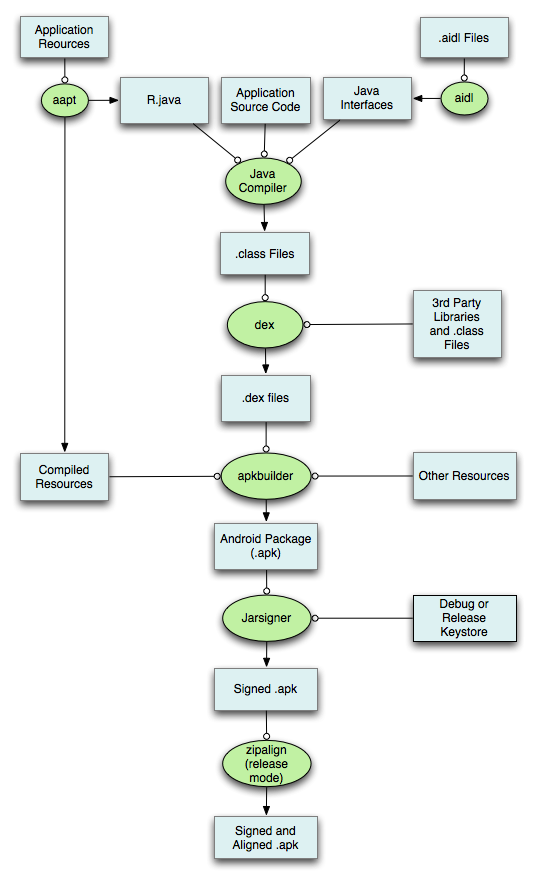

###The whole process

The process from official reference

The process from Ant build script

release 

####Step. aidl(Android Interface Definition Language)

			<aidl executable="${aidl}"
                    framework="${project.target.framework.aidl}"
                    libraryBinAidlFolderPathRefid="project.library.bin.aidl.folder.path"
                    genFolder="${gen.absolute.dir}"
                    aidlOutFolder="${out.aidl.absolute.dir}">
                <source path="${source.absolute.dir}"/>
            </aidl>

####Steps. Resources -> R.java

	<aapt executable="${aapt}"
                    command="package"
                    verbose="${verbose}"
                    manifest="${out.manifest.abs.file}"
                    originalManifestPackage="${project.app.package}"
                    androidjar="${project.target.android.jar}"
                    rfolder="${gen.absolute.dir}"
                    nonConstantId="${android.library}"
                    libraryResFolderPathRefid="project.library.res.folder.path"
                    libraryPackagesRefid="project.library.packages"
                    libraryRFileRefid="project.library.bin.r.file.path"
                    ignoreAssets="${aapt.ignore.assets}"
                    binFolder="${out.absolute.dir}"
                    proguardFile="${out.absolute.dir}/proguard.txt">
                <res path="${out.res.absolute.dir}" />
                <res path="${resource.absolute.dir}" />
            </aapt>

###What's in Android package

There're two kind of package:
#####apk 

Let's see an example, the following file list is from an unziped apk file.

All resource (such as layout, AndroidMenifest) are compiled.

file type | Explaination | build tool usage
-- | --
.dex | compiled file with all classes file | [sdk/build-tools/21.1.2/aapt](#aapt)
.arsc | compiled resource

#####aar

####Build tools usage
#####aapt 

1. Package the resources/assets/

	>$SDK_HOME/build-tools/21.1.2/aapt p -M ~/AndroidManifest.xml

2. list/delete/add files in apk/zip/jar

	>$SDK_HOME/build-tools/21.1.2/aapt l -v ~/Android-debug-unaligned.apk 
	>$SDK_HOME/build-tools/21.1.2/aapt
	>$./aapt d xmlstrings ~/Android-debug-unaligned.apk res/layout/main.xml	

