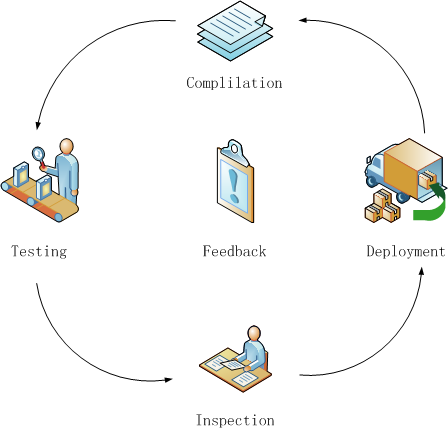
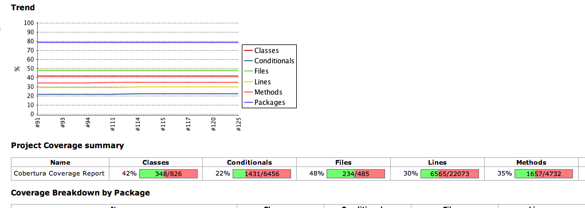
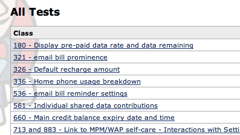
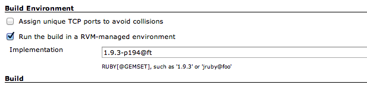
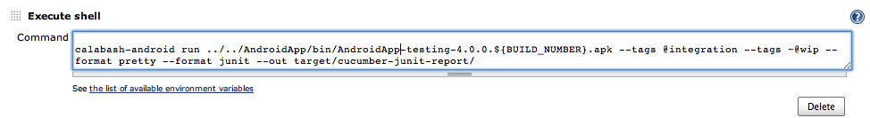
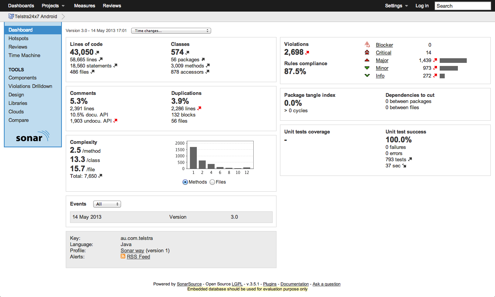

# 实现Android CI
CI在web-based application上已经有了非常成熟的实现，由此也积累了大量的优秀实践。但这些实践在Android平台中是否适用? 已知的CI工具是否能够很好的支持Android? Android CI是否也能即时的反馈Android Application的健康状况? 这篇文章中将通过实践，向大家展示Android CI可用的实现方法，是时候为我们的Android App搭建CI了。
## Android CI带来了什么？
* #### App质量的提升
事实上CI并不能直接提高App的质量，但是CI提供了对App的监测和反馈，通过持续的检测和反馈，可以完成对App的持续改进。 
在CI的Compilation阶段，若出现编译失败频率较高，一是因为代码未按照原子提交的原则进行，二是本地开发环境不干净，存在与CI环境不一致的地方，导致每次提交时不能提交所有文件，总是需要手动挑选提交文件。
 
在CI的Testing阶段，若出现失败，很有可能说明此次提交已经破坏了与之相关联的功能或者模块。App通过Testing，就是App可用性的一种反馈。
 
CI的Inspection阶段会对代码做多方面的考察，如Checkstyle，单元测试覆盖率，代码静态bug分析等，这些都是对代码质量的检测，通过这些改善检测结果，代码质量也就会随之得到提高。
 
CI将各环节的结果反馈给整个团队，团队为改善这些结果付出努力后，App的质量自然也就得到了提升。这也就是为什么反馈环节在CI是如此的重要，以至于失去它，CI无法发挥任何作用。

* #### 风险降低
CI将项目当前的健康状况即时的通报给整个团队，使得项目状况变得十分透明。团队成员在获得CI的反馈后，会关心项目的健康状况，逐步的团队所有人都习惯为App质量承担起自己的责任。
 
Bug的出现总是不可避免的，那就希望这些bug尽早的出现。持续的进行Testing可以让bug尽可能早的被发现。同时很快就能定位bug引入时间，并解决它。在发布前夕，发现App竟然存在部署问题，这一定会让大家变得紧张起来。持续的进行Deploy，可以让这些问题尽早的暴露出来并解决。

* #### 重复步骤减少
为了得到一个可发布的Android App，需要经历编译，测试，验证，部署等众多步骤。为了节约出包的时间，减少对资源的消耗，保证步骤都被正确执行。CI可以帮组构建一个可以重复执行的出包流程，并通过不断的优化，缩短时间。这样一个确定的出包步骤能够让开发人员在本地环境快速的完成部署。

* #### 对产品的信心增强
项目在一个透明的环境中运行着，团队成员都关注这App质量，努力改善项目健康状况。这样一个齐心协力的团队状态，相信整个团队对于项目的信心也会随之增加。

## Android CI面临的困难
* Android环境存在不稳定。Android的模拟器在虚拟机中存在不能稳定运行的状况。
* 自动化框架不够成熟。尤其是自动化测试。
* 无法完成自动化部署。
* Android设备中有些性能较低。需要在这些设备上运行Function Test时资源紧缺就更加明显。
* Android正在快速发展，带来了多个差异较大版本。那CI就应该对这些版本都能够兼容。

## 一步步实现Android CI
Android上的CI构建链与其它平台一致，依然包含Compilation, Testing, Inspection, Deploying阶段，每一个阶段的Feedback的都保持对整个团队透明。

CI中各个步骤执行先后顺序的安排，应该是执行时间较短的优先执行。执行时间短的一般在提交代码前就可执行，错误率也比较低，就应该尽可能先执行。这样失败会来得更早一些，每一次CI运行失败前验证完毕的东西更多。上图中CI的工作流，正是在这样的一个原则的基础上形成的。

#### 环境准备
* 在CI服务器上安装Java和Android运行环境
* 安装构建工具，本文采用Ant进行实践
* 搭建好CI服务。本文采用开源的CI服务Jenkins（Hudson）。Jenkins在功能上完全能够满足功能上的需要，且简单易用。
* 安装Ruby环境。本文中使用的Functional Test测试工具是基于Ruby实现的。

#### 步骤 1：持续构建

持续构建的目的是随时可自动化生成最新的可运行的App。虽然有这么多限定词来表示这一步完成的验证条件，但事实上只需要经过三个步骤即可完成。

一是更新代码，Jenkins中已经很好的支持了SVN和Git这两项常用的代码管理工具。二是采用构建脚本构建安装包，Android已经很贴心的连Ant构建脚本都为我们准备好了，并且因为Android的包结构的规范，也很大程度上消除各开发人员环境下项目机构的不一致。三是持续执行前两步，只有在每一次出现任何代码变动时立即执行前两步才能保证随时都可以提供可运行的安装包。

持续构建实现起来比较容易，但是它所达成的效果还是很不错的。对开发人员来说，都可以采用同一个脚本快捷的在本地生成安装包，这在很大程度上也减少了出现“这在我机器上运行的很好”的问题。对于测试人员，随时都可以获取最新的测试包，不需要再等待开发人员腾出时间来做这件事。对于产品人员，可以利用这些最新包，在开发人员完成后第一时间获得反馈。甚至可以在完成部分功能的情况下就开始体验了。

**Best Practice:**

* 在每一次提交后都对整个project进行构建。这里的提交应该包含任何一个微小的改动。
* 所有人遵循相同的构建顺序，采用同一套构建脚本
* 每次构建的时候都执行同一套脚本

#### 步骤 2：持续测试
持续测试是快速的通过自动化的手段收集软件健康状况的方法。持续测试是为了验证构建完成的包功能是否可用，而不仅仅能够安装运行。对App的测试可以从UI, Function, Code三个层次来进行，这三者间的权重关系可以参照测试金字塔来设计。

根据前文提到的优先运行最快的原则，这三个层次的测试，应该按照Unit Test， Functional Test，和UI Test的先后顺序安排在CI执行。

##### 添加Unit Test
Unit Test是运行成本最低的测试，并且对于测试用例覆盖最为全面。鼓励尽可能利用单元测试覆盖用例。Java中的单元测试首选的还是使用JUnit，但Android project的代码因为对SDK存在着极强的依赖，仅仅使用JUnit进行单元测试，能够覆盖的代码实在太少。为了解除对SDK的依赖，自然会考虑引入Mockito这样的Mock框架。但即使借助Mockito写单元测试的工作量依然巨大，因为需要mock的对象实在太多。并且Android的object在JVM中无法创建。

这时可以采用Robolectric单元测试框架，这将大幅度提升单元测试覆盖率，且理论上可以达到100%。Robolectric是以JUnit为核心，完成了对Android SDK的stub。采用stub的方式后，Android的组件在JVM中即可创建并运行，无需在Android平台下运行。这也意味着在Android开发中可以采用TDD的方式，进一步提高单元测试覆盖率。该框架的使用JUnit完全一样，运行性能也一致。

由于Robolectric对SDK进行了stub，在写单元测试时完全可以对组件状态进行验证，甚至可以对组件进行操作。下面这个测试就是对button点击事件的测试，并且验证了Activity的状态。

	@Test
    public void should_be_finished_if_clicked_on_cancel_button() {
        Robolectric.application.onCreate();

        CustomActivity activity = new CustomActivity();
        Intent newIntent = new Intent();
        activity.setIntent(newIntent);
        activity.onCreate(null);

        Button cancelButton = (Button) activity.findViewById(R.id.cancelButton);
        cancelButton.setVisibility(View.VISIBLE);

        Robolectric.clickOn(cancelButton);

        assertTrue(activity.isFinishing());
    }

接下来的工作就是将Robolectric集成到CI中，让它检查程序的健康状况。Robolectric本质上还是JUnit，只是多了一些stub 对象而已。那我们集成Robolectric的方法和JUnit完全一致。只需创建Ant task，并在Jenkins中执行此task即可。此Ant task如下：
	
	<target name="unit-test" depends="clean, init, compile">
        <junit fork="yes" dir="." failureProperty="test.failed" haltonerror="false" haltonfailure="false"
               printsummary="yes" forkmode="perBatch"
               showoutput="no">
            <classpath location="${cobertura.instrumented.dir}"/>
            <classpath>
                <pathelement path="${tested.project.dir}/bin/classes"/>
            </classpath>

            <classpath location="${classes.dir}"/>
            <classpath refid="test.classpath"/>

            <formatter type="brief" usefile="false"/>

            <formatter type="xml"/>
            <batchtest todir="${reports.xml.dir}">
                <fileset dir="${src.dir}">
                    <include name="**/*Test.java"/>
                    <exclude name="**/AllTests.java"/>
                </fileset>
            </batchtest>
        </junit>

        <junitreport todir="${reports.xml.dir}">
            <fileset dir="${reports.xml.dir}">
                <include name="TEST-*.xml"/>
            </fileset>
            <report format="frames" todir="${reports.html.dir}"/>
        </junitreport>
        <fail if="test.failed" message="Unit test(s) failed."/>
    </target>

在将这些测试集成至CI后，最重要的一步收集结果是不能忘的。之前已经说过Calabash也可按照单元测试报告规范输出，加上Robolectric本身就是JUnit框架的扩展，报告也是按照单元测试报告规范输出。Unit Test和Function Test的报告即可使用JUnit test收集。

要想获得单元测试覆盖率报告，Cobertura是个不错的选择。添加Cobertura的script如下:

	<target name="coverage-report">
        <cobertura-report srcdir="${tested.project.src}" destdir="${cobertura.coverage.xml.dir}" format="xml"/>
    </target>

    <target name="summary-coverage-report">
        <cobertura-report srcdir="${tested.project.src}" destdir="${cobertura.coverage.summaryxml.dir}" format="summaryXml"/>
    </target>

    <target name="alternate-coverage-report">
        <cobertura-report destdir="${cobertura.coverage.html.dir}">
            <fileset dir="${tested.project.src}">
                <include name="**/*.java"/>
            </fileset>
        </cobertura-report>
    </target>

    <target name="coverage"
            depends="clean,compile,instrument,unit-test,coverage-report,summary-coverage-report,alternate-coverage-report"
            description="Compile, instrument ourself, run the tests and generate JUnit and coverage reports."/>

从Jenkins上即可获得清晰的单元测试覆盖率的报告     
    
    

##### 添加Function Test
Android为大家提供了一套集成测试框架Android integration testing framework。但此框架未集成Cucumber，这导致每增加一个Function Test都需要较大的开发和维护工作。这样高成本的实现Function Test将大大延缓开发进度，最终因为项目进度的原因导致Function Test被丢弃。产生这样的后果那必然是不愿意看到的。

目前Android平台下已经出现多种Functiong Testing[测试工具](http://stackoverflow.com/questions/2673746/gui-testing-with-instrumentation-in-android)，如Native Driver, Robotium, Calabash等。在尝试对比后，最终选择了Calabash Android作为解决方案。Calabash Android是Cucumber在Android平台的实现，使用Ruby书写Function Test，并提供了一组操作Anadroid App元素的API。

Calabash Android的主要优势有以下三点：

* 对于BDD的支持
* 使用Ruby实现Function Test更加的符合自然语言的习惯。使得QA也能轻松的实现Function Test 

利用Calabash提供的对App组件操作的API，实现启动App并登陆只需要以下短短的几行代码：

	Given /^I launch and login TelstraApp$/ do
	  step %Q|I launch the app|
  	  step %Q|I wait to see "MY ACCOUNT LOGIN"|
  	  step %Q|I enter "#{$username}" into input field number 1|
  	  step %Q|I enter "NotARealPassword" into input field number 2|
  	  step %Q|I press "Login to My Account"|
	end

* 支持Android和iOS使用相同的API操作App。使得iOS和Android平台中的Feature可以重用

** Jenkins集成Calabash Android **

运行Calabash Android需要Ruby环境，同时也建议安装RVM。在CI agent上安装Ruby和RVM，并为Jenkins安装RVM plugin后运行环境就准备好了。

在Jenkins中执行运行Calabash Android的shell命令前需要注意指定运行时的gemset  
  
Calabash Android在Jenkins中的执行命令如下：
  
Calabash在运行完毕之后，可以按照单元测试报告的规范提供测试报告

##### 添加UI Test
Android在新近退出了UI测试工具UIAutomator。此工具仅支持Android4.1及以上平台，鉴于目前市场上2.3和4.0版本仍占主导的情况来看，目前还无法满足大家的需要。另外应用该工具实现UI测试的开发成本还较高，笔者暂不推荐使用此工具，但应该关注其发展。

另外基于录制回放机制的测试方法同样可以进行UI测试。但录制回放的方法在面对功能快速迭代时，维护工作会急剧增加，而这个维护成本可以说是很难承受的，所以在此也不会将这种测试方法集成至CI中。

目前来看Android中UI测试还无令人满意的方法。若对UI成功比较看重，可以投入精力应用UIAutomator进行UI测试。

##### **Best Practice:**

* 将测试按照单元测试，组件测试，功能测试和系统测试进行划分。单元测试应该在每次提交时触发执行，其它的测试根据运行时间长短和重要程度可以每次提交触发执行或者定时周期执行。
* 将运行较快的测试优先执行。
* 让功能测试能够重复执行。否则维护成本太高，会被舍弃。若是后台数据导致不可重复，可以将数据抽象成为数据集，在每次运行前进行重置。
* 书写测试时每一个assert只做一种判断，这样可以明确每次测试的目的，并且可以快速定位测试失败愿意。

#### 步骤 3：持续检查
持续检查是对于代码本身检测和反馈。检测主要通过对代码静态分析验证代码风格，编程规范，代码复用，代码语言中的Best Practice等多个维度的代码质量。

Sonar作为一个开源的代码质量检测工具，涵盖了7项代码质量检测方式。这充分满足Android平台下对于代码质量的检测分析。Sonar分为两部分一部分是代码分析工具，另一部分是数据分析展示的Server。

Sonar可进行的分析维度在其Dashboard中可以看见:

Sonar的分析工具也有多种运行方式，可以由Ant script, Jenkins plugin, jar等多种方式运行，为了简化Jenkins的配置，本例子采用Ant script的方式运行：
	
	<target name="sonar">
        <taskdef resource="org/sonar/ant/antlib.xml">
            <classpath path="CISetup/sonar-ant-task-2.0.jar"/>
        </taskdef>
        <sonar/>
    </target>

**Best Practice:**

* 将测试覆盖率，代码分析结果透明化
* 持续降低代码复杂度
* 持续的促进设计的演进
* 持续的维护代码结构
* 持续减少代码重复

#### 步骤 4：持续部署
由于Android App采用用户手动从Appstore自行下载安装的方式发布，使得Android App无法直接部署至用户手机中。另外Appstore需要对于上线的App进行审核，不能持续进行Release。因而Android中持续部署将以持续发布可安装包为目标。

在以上目的下，只需根据自身项目资源找到合适的安装包管理工具即可。如本文采用Dropbox来管理所有安装包。
Dropbox作为一个云存储平台，在Android终端设备上可以轻松下载存放在其中的文件，同时上传安装包也可以交由Dropbox自己完成。

	<target name="copy-prod-apk-to-dropbox" >
		<echo message="copying ${basedir}/bin/AndroidApp-prod-${VERSION_NUMBER}.apk to ${dropbox.dir}/AndroidApp/R4/${VERSION_NUMBER}/" />
		<copy file="${basedir}/bin/AndroidApp-prod-${VERSION_NUMBER}.apk" todir="${dropbox.dir}/AndroidApp/R4/${VERSION_NUMBER}" overwrite="true" />
	</target>
	
**Best Practice:**

* 保证任何时间都能够发布可用的程序
* 为每一次build打上build号
* 执行部署签运行所有的测试
* 保证部署失败都能执行回滚

#### 步骤 5：持续反馈
反馈是所有改进的开始，必须要让所有人获取到他们所关心的反馈信息，才能实施改进。持续反馈的目的就是让所有人都掌握项目健康状况。项目所有人事实都是有意愿知道项目当前的健康状况的，那CI就应该将项目的情况做到透明，并将不同的反馈通知到各相关的成员。

CI不同阶段产生了不同维度的反馈，如单元测试报告，测试覆盖率等。本实践中将这些反馈都透明的展示在项目首页中。之所以没有将这些反馈再以邮件的方式通知所有人，是因为团队成员已经养成了查看CI的习惯。

如果说只给所有人发一封邮件说明项目状况，那必然是告诉所有人“CI所有步骤是否都返回正确？”。这样一个反馈，包含了编译正确，所有测试通过，安装包已经准备完毕等重要信息。有必要让所有人都知道这个信息，特别是在CI执行失败的时候。Jenkins自身已经提供一个简单有效的透明化方法，以项目为蓝色表示通过，红色表示有步骤失败。

Feedback的通知方式有很多种，不一定要采用邮件通知的方式。可以寻找更加有趣的方式，如果播放音乐和设置警报灯。在每一次Build成功或失败后都播放一段有趣的音乐，打开不同颜色的警报灯，这两种方法都是是一种简单有效的方式，可以让项目所有人都获取到最为关键的信息。

**Best Practice:**

* 向所有团队成员公布Feedback
* 形成持续的发布Feedback的机制

## 结束语
从本文的实践来看为Android项目搭建CI与其他类型项目步骤基本一致，所不一样的是各步骤中依赖的实现技术而已。确实也因为Android CI所依赖的技术的不够成熟，存在一些支持不足的情况，如对UI的测试，影响了CI的价值。但它CI的价值依然值得花时间去搭建。