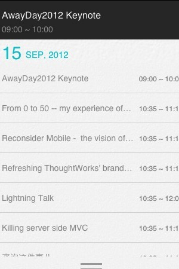
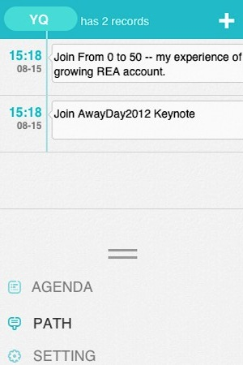
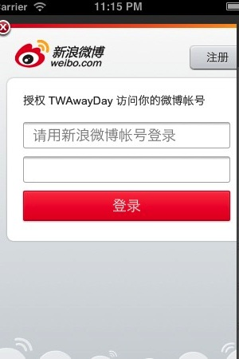
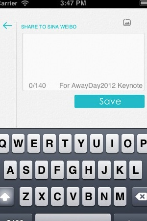

## Description

Help all TW guys to know all the awayday conference information, and share the confrenece news in your own sina weibo.

## New features:
1. Share conference news into your own Sina Weibo.
2. Get notification when the session information is changed

## Please Download our app:
Android from [here](http://awayday.thoughtworkers.org/AwayDay-release.apk)

iOS from [here](itms-services://?action=download-manifest&url=http://awayday.thoughtworkers.org/AwayDay2012.plist) [please access this link in iPhone]

## The App shortcuts:

    

